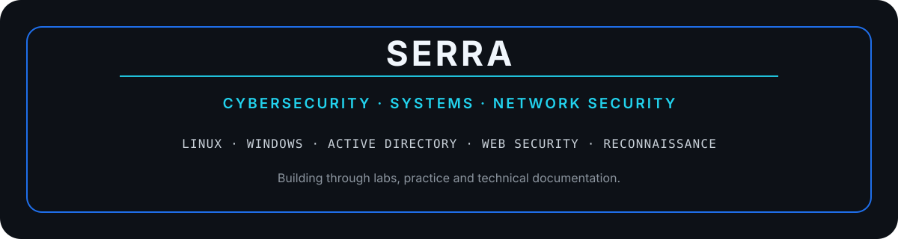

<div align="center">



<br>

Building a strong cybersecurity foundation through hands-on labs, structured learning and technical documentation.

</div>

---

## About

I’m focused on understanding how systems, networks and security mechanisms work in practice.

My current learning path combines hands-on labs, technical courses and continuous documentation across Linux, Windows, networking, Active Directory and web security.

## Current Focus

`Penetration Testing` · `Linux Security` · `Windows Security` · `Active Directory`

`Networking` · `Reconnaissance` · `Web Security` · `Cryptography`

## Featured Repository

### Cybersecurity Notes

A structured knowledge base documenting what I learn through labs, courses and practical exercises.

**Linux** · **Windows** · **Networking** · **Active Directory** · **Cryptography** · **Reconnaissance** · **Web Security**

[View Cybersecurity Notes →](https://github.com/YOUR_USERNAME/cybersecurity-notes)

## Learning Approach

```text
Understand the system
        ↓
Practice in a lab
        ↓
Analyze the behavior
        ↓
Document what I learned
        ↓
Build on it
```

## Tools & Technologies


---

<div align="center">

**Understand systems. Analyze behavior. Strengthen security.**

</div>
